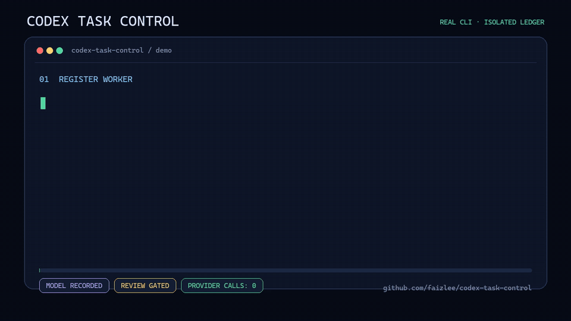

# Codex Task Control

一个只面向用户可见 Codex task、明确禁止内部 subagent 的本地可审计主控台账。

前沿模型适合规划、判断和审查，但重复机械操作会白白消耗昂贵额度。Codex Task Control 让前沿模型继续主控，禁止不可见的内部 subagent，只把确有额度收益的机械工作交给侧边栏里可检查、可单独选择便宜模型的 Codex task。

> v0.17.0 在稳定优先 watchdog 之上加入不可变对话检查点、渐进式预加载和可取消的安全主控交接。默认只加载已确认摘要，历史证据按需展开；交接前必须完全收口，且全程不调用模型 provider。

[English](README.md)



[MP4 版本](media/codex-task-control-demo.mp4) · 由 [`demo/render_demo.py`](demo/render_demo.py) 在临时隔离台账中运行真实 CLI 流程后生成。

## v0.17.0 已经解决什么

- 对话检查点独立保存到 `$CODEX_HOME/task-control/checkpoints/`，每次只保留 1-12 条带 authority 和来源索引的摘要，不复制原始 prompt、response、工具输出或项目内容。
- 默认 preload 只返回用户确认、项目事实、主控决策和已接受成果；候选、失败、争议与已废弃路径必须按 fact ID 或 full 模式显式查询。
- 安全交接要求无活跃/未派发子任务、待审/收口/侧边栏动作、开放并发批次、延后消息或 heartbeat 债务。prepared 可取消，不会维持 heartbeat；accepted 后 successor 成为新根主控，旧主控永久停止新派发。
- schema-v2 上下文健康回执只提供 `checkpoint_recommended` / `handoff_recommended` 建议；上下文占比、压缩次数、平均输入和 TTFT 不再自动成为阻塞阈值。旧 schema-v1 `handoff_required` 仅为兼容保留。

- 每次有效 watchdog 扫描都会计算业务状态指纹。连续两轮没有任务、事件、审查、消息或并发批次变化时，自动续期熔断并只通知一次。
- 已触发的 `COUNT=1` automation 会被视为已经消费。真实 progress 会清零无进展计数并准备新的 one-shot，不会误把已经触发的物理 watchdog 当成仍可续租。
- heartbeat 删除只允许一次自动补偿。第二次失败返回 `manual_heartbeat_cleanup_required`，不再生成自动重试，同时业务命令仍保持可用。
- 新增 `controller-resume-watchdog --reason ...`。只有旧 automation 已确认清理后才能显式恢复，并持久记录人工恢复原因。

- `controller-dispatch-rework` 现在只准备宿主消息，不增加 attempt、不把任务标成运行中。只有 `controller-confirm-rework-dispatched` 收到真实宿主回执后才原子进入下一轮；发送失败可以取消准备动作。
- 扫描会直接列出 `zombieAttempts` 与 `preparedReworks`。历史上 attempt 已增加但没有真实派发回执的任务，可以用 `controller-recover-undispatched-attempt` 恢复，不受 heartbeat 故障阻塞。
- implementation 的权威失败必须绑定合同中的 `evidenceCommandId`。临时 `--check-only`、探索命令或其他合同外命令失败只保存为 `non_authoritative_diagnostic`，不能停止任务、触发返工或改变验收。
- heartbeat 待确认、超时或删除失败仍会返回明确清理动作，但不再阻塞失败入账、收回、恢复或无关任务登记。只有并发 dispatch wave 部分发送这一种真实业务原子性缺口继续 fail closed。
- progress 在物理 one-shot 尚未触发时只续台账中的逻辑租约，不再每次都创建、替换、删除 Codex App automation。
- 并发要求的是“有独立增量价值的候选”，不是凑两个任务。初始单候选仍需退化证据；真实 wave 启动后，QA/只读候选完成造成自然收缩时无需再次补退化回执。
- HTML 顶部明确区分“已验证业务交付、实现候选提交、控制审查通过”。控制任务不再显示成业务集成；若业务交付为 0，会直接写出“本专题没有可验证的业务交付”。

- 每个 diagnostic 都按台账的“派发到执行结束”范围裁剪；派发前和任务结束后的同对话时间单列为“任务外空档”，不计入任务异常。
- 无法归因比例只使用已配对 active turn 内的未知区间；模型回合之间的空档另列观察，绝不冒充模型思考、网络、排队或服务端处理。
- 当前一个合法阶段事件仍等待直接主控入账时，worker 可以继续创建下一个有序阶段事件；中央 stageProgress 和 complete 仍必须等主控严格按顺序全部入账。
- implementation 标记 integrated 前，必须由 Git 证明 candidate commit 是目标 ref（默认 `HEAD`）的祖先。旧 integrated 台账保持只读兼容，但报告明确显示“Git 未验证”，不再冒充主线已集成。

- 登记、真实派发、有效 progress 入账、失败/完成、审查、集成和归档时，顺便追加 schema-v1 observability receipt；不会为了计时增加 worker 命令或 progress。
- 默认 `lean` 报告只读现有台账，不扫描 rollout、Desktop 或 OTel。
- 只有用户明确要求时才生成 `diagnostic` 报告：复用已安装的 `codex-time-diagnostics` analyzer，定位对应可见任务 rollout，并可读取用户显式传入的本地 OTel/Desktop 证据。
- 严格区分“派发窗口重叠”和“已配对 active turn 重叠”，不会把计划并发或仅已派发冒充真实并发执行。
- 按子任务展示模型/thinking、attempt、生命周期时间、active-turn union、工具/TTFT/上下文/压缩/重试、同 conversation completed-response token，以及不能归因到单个任务的账户额度快照。
- 普通成果页仍写入确定性的 `index.html`；按需诊断另写 `diagnostic.html`，不会覆盖日常 closeout 页面，也不会维持 heartbeat。
- HTML 的固定状态、任务类型、推理强度、异常和耗时字段全部使用中文；必须保留的模型名、事件名和协议标识会紧邻中文解释。自由文本若原本只有英文，会明确标记为“原始英文记录”，不会为了翻译额外调用模型。
- 一万以上显示为“万”，一亿以上显示为“亿”，同时保留精确值；诊断页用条形图直观比较各任务的累计输入、累计输出、活跃执行和工具调用。
- Token 只描述已经发生的模型请求所报告的累计处理量，不代表 OTel 本身的消耗，也不等于 Codex 额度账单。

- 创建 task 前先登记 schema-v1 `parallel_batch`，记录候选车道、依赖、冲突域、动态 WIP、review 容量和 implementation worktree 身份链。
- 有两个安全候选时强制 fan-out；只有一个时必须提交带类型、说明和证据的退化回执。代码候选与无冲突 QA/no-code/readonly 候选同时存在时，禁止只派代码任务。
- 所有候选改名完成后先准备整批 dispatch wave，再逐个真实发送并登记；宿主中途失败会留下明确的未完成波次，禁止主控悄悄继续其他业务。
- 生命周期边界后重新计算候选，并在扫描中返回空闲并发槽、可派候选、fan-out blocker、待完成派发和 batch replan 状态。
- 每个直接主控仍只有一个 heartbeat，监管整个批次；仅计划未派发或缺少退化证据时不会制造空心跳。

- worker 可以在 required stage 尚未完成时提交正式 `task_failed` / `task_blocked`，包含失败阶段、分类、命令摘要和证据引用。
- 即使没有 completion 或普通消息，主控扫描也会根据 lease、最后进度、attempt 时长和 candidate 缺失识别停滞。
- 主控给 worker 的普通补充消息在目标 turn 运行中或状态未知时先写入本地台账；只有外部确认目标 idle 后才生成 `send_thread_message` 动作，真实发送还必须用匹配的 action ID 和宿主回执入账。
- 普通消息禁止 interrupt/steer；只有明确授权的 `stop` / `cancel` 才会生成 `steer_thread_message`。目标任务已终态时，旧延后消息会取消，不能重新启动任务。
- replacement 继承稳定 objective；连续两个 replacement 失败或时间预算耗尽后，r3/new dispatch 直接 fail closed。
- 诊断缺少玩家影响、正常生命周期复现、增长趋势和阻塞价值时，只能登记为非阻塞技术债。
- reclaim/blocked 后必须完成用户摘要通知和 delivery report 刷新，才能创建 replacement。
- 可接收新旧上下文健康回执；v2 建议不阻塞，只有历史 v1 `handoff_required` 继续 fail closed。
- 新 implementation 合同升级为 schema v2，并明确 `allowedWritePaths`；旧 schema-v1 台账保持只读兼容。

- 按项目根目录隔离任务注册表。
- 记录直接父任务、controller、执行界面、模型等级、reasoning、额度理由和生命周期状态。
- 拒绝内部 subagent，只接受用户可见的 Codex task/thread。
- 委派必须显式授权，并使用 economical 模型与至少 medium reasoning；low 直接 fail closed。
- 架构/合同/错误策略未决、scope 或验收证据不明确时，登记直接 fail closed。
- 新登记必须显式分类为 `control_only`、`implementation` 或 `visual_implementation`；代码、资源、UI、测试和截图 runner 修改必须绑定项目根目录内的版本化 JSON 实施合同。
- 台账保存合同快照与 SHA-256 摘要；worker 改动复用要求、禁建路径、阶段、证据命令、错误策略或视觉预言时，派发、进度或完成都会 fail closed。
- 实施任务必须按顺序提交命名阶段与证据引用；当前轮次所有 required stage 入账前不能 complete。
- completion 与 review 输出明确返回合同版本/摘要以及已完成、缺失阶段；旧台账只读时安全识别为 `legacy_unclassified`，不会因扫描被重写。
- 将 `repeatable` 硬绑定到 `gpt-5.6-luna`，将 `bounded_reasoning` 硬绑定到 `gpt-5.6-terra`；旧模型或错配模型在登记时直接 fail closed。
- 将 `repeatable` 的 reasoning 固定为 medium，允许 `bounded_reasoning` 使用 medium 或 high。
- Sol 主控默认使用 high；边界明确的短主控工作允许 medium；xhigh/max 必须先通过零 provider 调用的 `audit-controller-routing`，并留下明确升级证据。
- 新增只读的活跃任务模型审计；安装器会报告遗留任务，但不会偷改模型身份或台账历史。
- 新增只读的活跃任务 thinking 审计，报告遗留 low 任务但不原地篡改其身份。
- 新增只读的终态归档积压审计，按登记的直接主控分组，生成后代优先的可执行动作，并识别旧版缺失的归档元数据。
- 审查失败先进入停止的“待决”状态，只允许一次明确的机械返工，其他失败由主控收回。
- 自动分配 `01`、`01.1` 这类层级编号，并把生命周期标题同步到 Codex 侧边栏。
- heartbeat 改为两阶段提交：本地 prepare、App 创建新 automation、确认并切换台账、最后删除旧 automation；App 失败时不会提前推进 confirmed generation。
- 每轮主控收口统一走一个入口。终态且已无业务队列时，如果仍有未确认的新 heartbeat create，会返回有界的 `finalize_controller_cycle`：按 action ID/generation 比较删除未确认 create，并删除最后一个 confirmed automation。
- 已超时的 pending heartbeat action 会返回有界补偿动作，但不再阻塞失败入账、收回、恢复或无关登记；宿主清理债务与业务生命周期分开审计。
- automation 强制 `COUNT=1`；第一次 stale、错误 ID、过期、重复触发或 RRULE 错配返回空队列的 `delete_stale_automation`，第二次异常转为人工清理，不再自动循环。
- 持久记录最后成功 generation、automation ID、pending action、触发/stale/删除失败/无进展次数、业务指纹、熔断证据、人工恢复原因与一次性通知状态。
- 新登记的 implementation 必须提交带 schema 版本的成果包，记录 candidate commit、用户可见摘要、实际改变、未完成项、测试/前后数值和带类型的 artifact 引用。
- 视觉任务完成前校验 presentation stage、必需 artifact 类型/里程碑、任务归属、合同允许根目录、文件存在、非零尺寸、SHA-256 去重以及 PNG/JPEG/GIF 可解码尺寸。
- 每个 attempt 的成果历史只追加不覆盖；reclaimed、blocked、changes_requested 证据明确显示为失败，并严格区分候选、已接受未集成、已集成。
- 直接主控可确定性生成手机/桌面自适应 HTML：`$CODEX_HOME/task-control/reports/<project-key>/<controller-thread-id>/index.html`，不写项目仓库。
- 自适应间隔为 Luna repeatable 3 分钟、Terra medium 5 分钟、Terra high 10 分钟、主控队列 5 分钟；多种义务并存时取最短间隔，旧 generation 触发时只允许清理它自己的 automation。
- 把可执行清理与历史债务分开：标题/归档工具调用一旦记录失败，仍可审计，但不会反复生成动作或单独维持 heartbeat。
- 只有登记的直接主控可以带原因显式重新排队失败的侧边栏动作。
- `integrated`、`blocked` 或 `reclaimed` 的可见任务按后代优先顺序归档，但完整台账历史永久保留。
- 子任务只能查询自己、生成带阶段证据的 progress event、completion event 或通知失败回执。
- 只有 controller 可以登记、要求返工、接受和集成。
- 拒绝不安全 task ID、旧事件、项目错配、父子环和矛盾状态。
- 使用原子写入和保守的 stale-lock 恢复协议。
- 不覆盖项目自己的规则、命令、测试和验收流程。
- 台账操作零 provider 调用。

## v0.17.0 不做什么

- 不读取或重置 Codex 额度。
- 不承诺固定节省百分比。
- 不自动创建、停止、发送或 steer Codex task；Skill 只返回带身份约束的宿主动作，并记录真实回执。
- 当前 Codex App 的程序化发消息工具没有显式 queue/steer、原子多任务发送或“已进入队列”的回执。因此 v0.17.0 用本地 dispatch wave、消息延后和确认命令做安全补偿；未来宿主提供原生 batch/queue + ack 后才能替换。
- 无法拦截绕过 skill 直接调用的内部 subagent 工具，因此还必须用 `AGENTS.md` 明确禁止这类调用。
- 无法保证 heartbeat 消息在进入模型上下文前就被 Codex App 删除，也不能取消已经挂起的宿主工具调用。v0.17.0 接受可能多消耗一次唤醒，但保持业务恢复开放，并在有界证据后停止自动续期；宿主 hook 只用于消除这一次额外唤醒，不再是避免循环的前提。
- 不替项目判断截图“好不好看”；视觉质量继续由项目 `visualOracle` 和登记的直接主控审查。
- 当前只对 Windows 项目路径做了完整验证。

## 安装

需要 Node.js 20 或更高版本。

```powershell
git clone https://github.com/faizlee/codex-task-control.git
cd codex-task-control
pwsh -File .\scripts\install.ps1
```

覆盖旧版本：

```powershell
pwsh -File .\scripts\install.ps1 -Force
```

安装器会把 skill 复制到 `${CODEX_HOME:-~/.codex}/skills/codex-task-control`，然后执行只读的模型路由、thinking 路由和终态归档积压审计。它不会修改全局 `AGENTS.md`，也不会改写 live task ledger；报告的遗留任务必须由登记的直接主控处理。

然后把 [`examples/AGENTS.md`](examples/AGENTS.md) 中适用的控制规则加入你的用户级或项目级 `AGENTS.md`。

核心规则：绝不使用内部 subagent 或 `spawn_agent`；委派只能创建用户可见的 Codex task/thread。先规划并发批次，默认至少保留两个安全候选；单任务必须登记退化证据。每个候选都要独立登记和真实改名，整批通过 `controller-prepare-parallel-dispatch` 后才逐个发送并记录。后续普通消息必须先经过 `controller-prepare-message`；运行中不直接调用宿主发送，确认 idle 后才 release，interrupt 只用于有权限的停止/取消。

Sol 主控默认使用 high；medium 只用于边界明确的短控制工作。xhigh 必须记录允许的升级触发条件和具体原因；max 只允许用户明确授权或 xhigh 仍未解决的最终仲裁。搜索、格式化、命令、重复测试和机械实现不得使用 Sol xhigh/max。

## 快速开始

先把 [`parallel-batch.example.json`](skill/codex-task-control/assets/parallel-batch.example.json) 复制到项目内，替换候选、冲突域、依赖、容量和 worktree 身份。实施任务还要复制 [`implementation-contract.example.json`](skill/codex-task-control/assets/implementation-contract.example.json)，替换项目路径、阶段、命令和错误策略，并赋予明确 revision 或 commit。视觉任务可以从 [`visual-implementation-contract.example.json`](skill/codex-task-control/assets/visual-implementation-contract.example.json) 开始。

```powershell
$CodexHome = if ($env:CODEX_HOME) { $env:CODEX_HOME } else { Join-Path $HOME '.codex' }
$TaskControl = "$CodexHome\skills\codex-task-control\scripts\task-control.mjs"

node $TaskControl audit-controller-routing `
  --model "gpt-5.6-sol" `
  --thinking "xhigh" `
  --work-class "hard_arbitration" `
  --escalation-trigger "cross_module_contract_conflict" `
  --reason "多个模块存在互相冲突的合同边界，需要前沿主控仲裁。"

node $TaskControl controller-plan-parallel-batch `
  --project-root "C:\work\example" `
  --controller "controller-1" `
  --manifest "docs/codex-parallel-batch.json"

$Registration = node $TaskControl register `
  --project-root "C:\work\example" `
  --controller "controller-1" `
  --thread "worker-1" `
  --parent "controller-1" `
  --title "Implement bounded authentication change" `
  --model "gpt-5.6-terra" `
  --thinking "medium" `
  --delegation "explicit" `
  --execution-surface "visible_task" `
  --model-class "economical" `
  --quota-reason "Bounded implementation is cheaper than using the frontier controller." `
  --work-class "bounded_reasoning" `
  --decision-status "resolved" `
  --scope "Only update the named authentication tests." `
  --acceptance "Run the targeted authentication test successfully." `
  --forbidden-decisions "Do not change authentication contracts or error policy." `
  --task-mode "implementation" `
  --implementation-contract "docs/codex-task-contract.json" `
  --parallel-policy "batch_v1" `
  --batch-id "auth-batch" `
  --candidate-id "auth-code"

$Registration = $Registration | ConvertFrom-Json
```

登记会返回类似 `执行｜01 Audit authentication flow` 的标题，并且初始 `dispatchAllowed: false`。主控必须先使用 Codex 改名工具真实修改侧边栏标题，再执行：

```powershell
node $TaskControl controller-record-title-synced `
  --project-root "C:\work\example" `
  --controller "controller-1" `
  --thread "worker-1" `
  --title $Registration.desiredThreadTitle

# 对 fan-out 选中的每个候选重复登记和真实改名，然后先准备整批派发波次。
node $TaskControl controller-prepare-parallel-dispatch `
  --project-root "C:\work\example" `
  --controller "controller-1" `
  --batch-id "auth-batch"

# 真实发送每个返回任务的提示词；每次成功后分别登记。
node $TaskControl controller-record-dispatched `
  --project-root "C:\work\example" `
  --controller "controller-1" `
  --thread "worker-1"

node $TaskControl query-self --self "worker-1"
node $TaskControl query-parent --self "worker-1"
node $TaskControl complete --self "worker-1" --candidate-commit "candidate-v1" --result-manifest "docs/test-reports/task-result.json"
```

不能在没有真实改名的情况下伪造同步成功，也不能在提示词真实发送前登记派发。每个 prepared heartbeat action 都必须创建新的 `COUNT=1` automation，在 prompt 中带 action ID 和 generation；App 返回新 ID 后执行 `controller-confirm-heartbeat-action`，再删除返回的 retired ID。App 报错或 30 秒超时必须执行 `controller-record-heartbeat-action-failed`，不得伪造成功或提前推进 generation。终态后代先归档，父任务后归档，台账历史不会删除。

后续补充消息使用独立的 prepare/release/receipt 协议。目标运行中时只返回 `deferred_local`，没有宿主动作；外部真实确认任务 idle 后再 release、执行返回的发送动作并记录真实回执：

```powershell
$Queued = node $TaskControl controller-prepare-message --project-root "C:\work\example" --controller "controller-1" --thread "worker-1" --kind follow_up --delivery-mode queue --target-turn-state running --message "补跑已经批准的检查。" | ConvertFrom-Json
$Prepared = node $TaskControl controller-release-message --project-root "C:\work\example" --controller "controller-1" --message-id $Queued.messageId --target-turn-state idle | ConvertFrom-Json
# 只有现在才真实调用宿主发送工具，然后记录它的成功回执：
node $TaskControl controller-record-message-delivery --project-root "C:\work\example" --controller "controller-1" --message-id $Prepared.messageId --action-id $Prepared.actionId --outcome delivered --receipt "host-send-receipt"
```

每轮主控事件处理、closeout、报告和侧边栏动作结束后，必须先通过单入口收口，再继续项目业务：

```powershell
node $TaskControl controller-finalize-cycle `
  --project-root "C:\work\example" `
  --controller "controller-1"

node $TaskControl controller-assert-business-ready `
  --project-root "C:\work\example" `
  --controller "controller-1"
```

必须先真实执行 finalizer 返回的宿主动作。遇到 `finalize_controller_cycle` 时，按精确 action ID/generation 比较删除被取代的 create，再删除精确的旧 confirmed automation ID，最后用 `--pending-create-cleanup-outcome deleted|not_found` 确认。如果任一步超时就记录失败；在清理确认前不得登记、派发或继续该主控的项目业务。

新 implementation 合同还必须声明 `resultRequirements`。worker 完成时提交项目内成果 manifest，主控审查后生成专题历史页：

```powershell
node $TaskControl mark-accepted --project-root "C:\work\example" --controller "controller-1" --thread "worker-1" --reason "合同和视觉预言均通过。" --selected-artifact "after"
node $TaskControl mark-integrated --project-root "C:\work\example" --controller "controller-1" --thread "worker-1" --integration-target-ref "HEAD"
node $TaskControl controller-query-deliverables --project-root "C:\work\example" --controller "controller-1"
node $TaskControl controller-build-delivery-report --project-root "C:\work\example" --controller "controller-1"

# 只有用户要求排查耗时或消耗时才运行：
node $TaskControl controller-build-delivery-report --project-root "C:\work\example" --controller "controller-1" --observability diagnostic --otel-jsonl "$HOME\.codex\otel-local\data"
```

需要把长对话收敛成按需加载的事实索引时，先按 `skill/codex-task-control/assets/conversation-checkpoint.example.json` 准备 manifest：

```powershell
node $TaskControl controller-seal-checkpoint --project-root "C:\work\example" --controller "controller-1" --manifest "C:\scratch\checkpoint.json"
node $TaskControl controller-query-checkpoint --project-root "C:\work\example" --controller "controller-1" --mode preload
node $TaskControl controller-query-checkpoint --project-root "C:\work\example" --controller "controller-1" --point "open-question-1"
```

交接前先关闭所有任务、审查、消息、并发批次和 heartbeat 债务，然后准备、接受或取消：

```powershell
node $TaskControl controller-prepare-handoff --project-root "C:\work\example" --controller "controller-1" --successor "controller-2" --checkpoint "checkpoint-0001"
node $TaskControl controller-accept-handoff --project-root "C:\work\example" --controller "controller-1" --successor "controller-2" --handoff-id "<id>" --checkpoint-digest "<sha256>"
node $TaskControl controller-cancel-handoff --project-root "C:\work\example" --controller "controller-1" --handoff-id "<id>" --reason "successor 未创建"
```

默认 `lean` 只生成 `index.html`，不读取 rollout/OTel。显式 `diagnostic` 在同目录生成 `diagnostic.html`，并分别显示任务外空档、任务窗口内但不在已配对 turn 中的空档、active turn 和 active turn 内无法归因；只有最后一个比例参与异常判断。页面采用中文解释与万/亿紧凑数字，并保留精确值和任务间比较条。只有同 conversation OTel completed-response 回执存在时，token 才能按 task 直接统计；这些 token 是已发生请求的累计处理量，不是 OTel 开销，也不是额度账单。rate-limit snapshot 仍是账户级包络；unknown 永远保持未归因。

非视觉成果包参考 [`assets/result-manifest.example.json`](skill/codex-task-control/assets/result-manifest.example.json)，视觉成果包参考 [`assets/visual-result-manifest.example.json`](skill/codex-task-control/assets/visual-result-manifest.example.json)，回执结构参考 [`assets/observability-receipt.example.json`](skill/codex-task-control/assets/observability-receipt.example.json)。旧任务没有可信历史资料时只显示“历史证据不可用”，不会伪造截图或阻塞当前任务。

如果侧边栏改名或归档工具调用失败，只记录一次失败。它会成为不再自动执行的审计债务；没有其他工作时 heartbeat 必须停止。登记的直接主控以后可以有意识地重新排队：

```powershell
node $TaskControl controller-retry-thread-action `
  --project-root "C:\work\example" `
  --controller "controller-1" `
  --thread "worker-1" `
  --action "set_thread_archived" `
  --reason "Codex 归档 API 已恢复，显式重试一次。"
```

子任务到达真实检查点时可以发送进度；主控成功入账后才会续租：

```powershell
node $TaskControl progress `
  --self "worker-1" `
  --summary "已复用并检查现有认证路径。" `
  --stage "reuse-check" `
  --evidence-ref "diff-check=artifacts/diff-check.txt"
node $TaskControl controller-ingest-progress `
  --project-root "C:\work\example" `
  --controller "controller-1" `
  --event "<返回的事件路径>"
```

子任务提交 candidate 后只能停在 `awaiting_review`：

```text
executing -> awaiting_review -> accepted -> integrated
                 \----> changes_requested（已停止 / 待决）
                              \----> 明确派发一次机械返工
                              \----> 主控收回
```

完整存储、事件和锁协议见 [`lifecycle.md`](skill/codex-task-control/references/lifecycle.md)。

审查不通过后，先记录原因，再由主控明确选择返工或收回：

```powershell
node $TaskControl mark-changes-requested `
  --project-root "C:\work\example" --controller "controller-1" --thread "worker-1" `
  --failure-class "mechanical" --reason "A named assertion is missing."

# 只允许第一次机械性失败原 worker 返工：
node $TaskControl controller-dispatch-rework `
  --project-root "C:\work\example" --controller "controller-1" --thread "worker-1"

# 理解/判断/规格失败，或已经返工过一次：
node $TaskControl controller-reclaim `
  --project-root "C:\work\example" --controller "controller-1" --thread "worker-1" `
  --reason "The controller must resolve the contract boundary."
```

## 验证

```powershell
npm run check
npm test
```

测试全部运行在临时 `CODEX_HOME`，并会比较测试前后的真实 live ledger，避免测试污染用户环境。

## 后续路线

- 跨平台项目路径规范化。
- 在 work-class 路由之上增加可选的项目级具体模型名验证。
- 扩展当前改名/归档工具之外的 Codex task 界面兼容性。
- 可见任务的 fan-out、深度和停止点预算。
- 宿主原生的 request/queue/model 分阶段回执；用户级诊断无法自行制造这些相关边界。
- 产品提供可信关联源后，再展示精确的单任务额度账单。

## License

MIT
